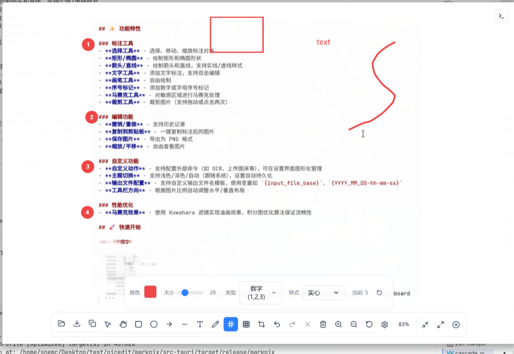

# MarkPix

一个现代化的跨平台图片标注工具，基于 Tauri + React + TypeScript 构建。



## ✨ 功能特性

### 标注工具
- **选择工具** - 选择、移动、缩放标注对象，支持实时编辑属性
- **矩形/椭圆** - 绘制矩形和椭圆形状
- **箭头/直线** - 绘制箭头和直线，支持多种箭头样式（经典、填充三角形、空心三角形）
- **文字工具** - 添加文字标注，支持普通文字和气泡样式（可调节圆角、尾巴方向）
- **画笔工具** - 自由绘制
- **序号标记** - 添加数字或字母序号标记
- **马赛克工具** - 对敏感区域进行马赛克处理
- **裁剪工具** - 裁剪图片（支持拖动或点击两次）

### 编辑功能
- **实时属性编辑** - 选中标注后可实时修改颜色、粗细等属性
- **撤销/重做** - 支持历史记录
- **复制到剪贴板** - 一键复制标注后的图片
- **保存图片** - 导出为 PNG 格式
- **缩放/平移** - 自由查看图片, 使用鼠标中键拖拽平移，鼠标滚轮缩放大小

### 自定义功能
- **自定义动作** - 支持配置外部命令（如 OCR、上传图床等），可在设置界面图形化管理
- **主题切换** - 支持浅色/深色/自动（跟随系统），设置自动持久化
- **输出文件配置** - 支持自定义输出文件名模板，使用变量如 `{input_file_base}`、`{YYYY_MM_DD-hh-mm-ss}`

### 界面特性
- **顶部工具栏** - 集成标题栏，空白区域可拖动窗口
- **浮动属性面板** - 选中标注时自动显示属性编辑面板

### 性能优化
- **马赛克效果** - 使用 Kuwahara 滤镜实现油画效果，积分图优化算法保证流畅性

## 🚀 快速开始


### 安装使用

如果你是 archlinux 用户 可以使用 yay 或者 paru 来安装 `paru -S markpix-bin`  或者 `yay -S markpix-bin`
如果你是其他发行版用户 需要先安装依赖，然后在 发布页面下载对应平台的二进制文件或者包


### 环境要求（开发环境）

- Node.js 18+
- pnpm（推荐）或 npm
- Rust 1.70+
- 系统依赖（Linux）：
  ```bash
  sudo apt install libwebkit2gtk-4.1-dev libappindicator3-dev librsvg2-dev patchelf wl-clipboard
  ```

### 安装依赖

```bash
pnpm install
```

### 开发模式

```bash
pnpm tauri dev
```

### 构建发布

```bash
pnpm tauri build
```

## 📦 命令行使用

```bash
# 直接打开图片
markpix /path/to/image.png

# 查看帮助
markpix --help
```

## ⌨️ 快捷键

| 快捷键 | 功能 |
|--------|------|
| `Ctrl+O` | 打开图片 |
| `Ctrl+S` | 保存图片 |
| `Ctrl+C` | 复制到剪贴板 |
| `Ctrl+V` | 从剪贴板粘贴 |
| `Ctrl+Z` | 撤销 |
| `Ctrl+Shift+Z` | 重做 |
| `Delete` | 删除选中标注 |
| `V` | 选择工具 |
| `H` | 手型工具 |
| `R` | 矩形工具 |
| `E` | 椭圆工具 |
| `A` | 箭头工具 |
| `L` | 直线工具 |
| `T` | 文字工具 |
| `B` | 画笔工具 |
| `M` | 序号标记 |
| `U` | 马赛克工具 |
| `C` | 裁剪工具 |

## 🔧 配置文件

配置文件位于 `~/.config/markpix/config.toml`：

```toml
# 主题设置: light, dark, auto
theme = "auto"

# 输出文件名模板
# 可用变量: {input_file_base}, {input_file}, {YYYY_MM_DD-hh-mm-ss}
output_pattern = "{input_file_base}_{YYYY_MM_DD-hh-mm-ss}_markpix.png"

# 自定义动作
[[custom_actions]]
name = "OCR 识别"
command = "tesseract {file} stdout"
icon = "scan"

[[custom_actions]]
name = "上传到图床"
command = "curl -F 'file=@{file}' https://your-image-host.com/upload"
icon = "upload"

[[custom_actions]]
name = "打开所在文件夹"
command = "xdg-open \"$(dirname \"{file}\")\""
icon = "folder"
```

> 💡 也可以在设置界面中图形化管理自定义动作，无需手动编辑配置文件。

## 🛠️ 技术栈

- **前端**: React 19 + TypeScript + Vite
- **UI**: TailwindCSS + Lucide Icons
- **画布**: Konva.js + react-konva
- **状态管理**: Zustand
- **后端**: Tauri 2 + Rust
- **跨平台**: Windows / macOS / Linux

## 📄 许可证

MIT License

## 🤝 贡献

欢迎提交 Issue 和 Pull Request！
